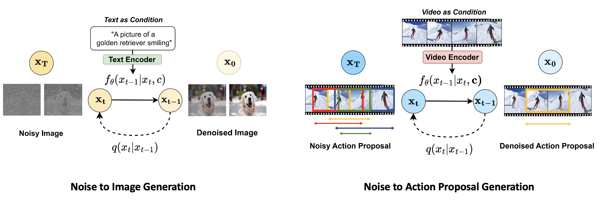
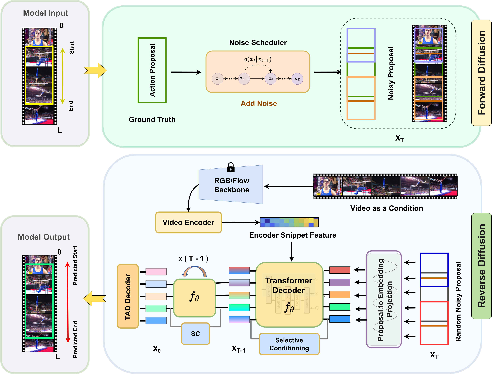

## DiffTAD: Temporal Action Detection with Proposal Denoising Diffusion

**DiffTAD is the first formulation of diffusion model for Temporal Action Detection task.**

<!--  -->
<p align="center">

  </p>

> [**DiffTAD: Temporal Action Detection with Proposal Denoising Diffusion**](https://arxiv.org/abs/2303.14863)               
> [Sauradip Nag](https://sauradip.github.io/), [Xiatian Zhu](https://xiatian-zhu.github.io/), [Jiankang Deng](https://jiankangdeng.github.io/), [Yi-Zhe Song](https://scholar.google.co.uk/citations?user=irZFP_AAAAAJ&hl=en), [Tao Xiang](https://scholar.google.co.uk/citations?user=MeS5d4gAAAAJ&hl=en)             
> *[arXiv 2303.14863](https://arxiv.org/abs/2303.14863)* 

## Updates
- (03/2023) Code will be released soon.

## Abstract
We propose a new formulation of temporal action detection (TAD) with denoising diffusion, DiffTAD in short.
Taking as input random temporal proposals, it can yield action proposals accurately given an untrimmed long video.
This presents a generative modeling perspective, against
previous discriminative learning manners. This capability
is achieved by first diffusing the ground-truth proposals to
random ones (i.e., the forward/noising process) and then
learning to reverse the noising process (i.e., the backward/denoising process). Concretely, we establish the denoising
process in the Transformer decoder (e.g., DETR) by introducing a temporal location query design with faster convergence in training. We further propose a cross-step selective conditioning algorithm for inference acceleration. Extensive evaluations on ActivityNet and THUMOS show that
our DiffTAD achieves top performance compared to previous art alternatives.

## Architecture
<p align="center">

  </p>
  
## Qualitative Visualization

<p align="center">

  </p>

## Citing DiffTAD

If you use DiffTAD in your research or wish to refer to the baseline results published here, please use the following BibTeX entry.

```BibTeX
@article{nag2023difftad,
      title={DiffTAD: Temporal Action Detection with Proposal Denoising Diffusion},
      author={Sauradip Nag and Xiatian Zhu and Jiankang Deng and Yi-Zhe Song and Tao Xiang},
      journal={arXiv preprint arXiv:2303.14863},
      year={2023}
}
```
